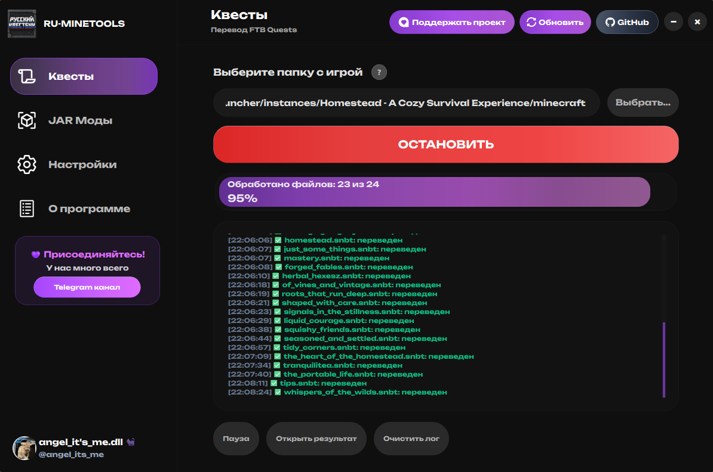
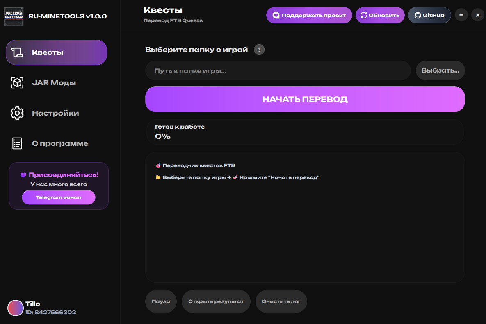
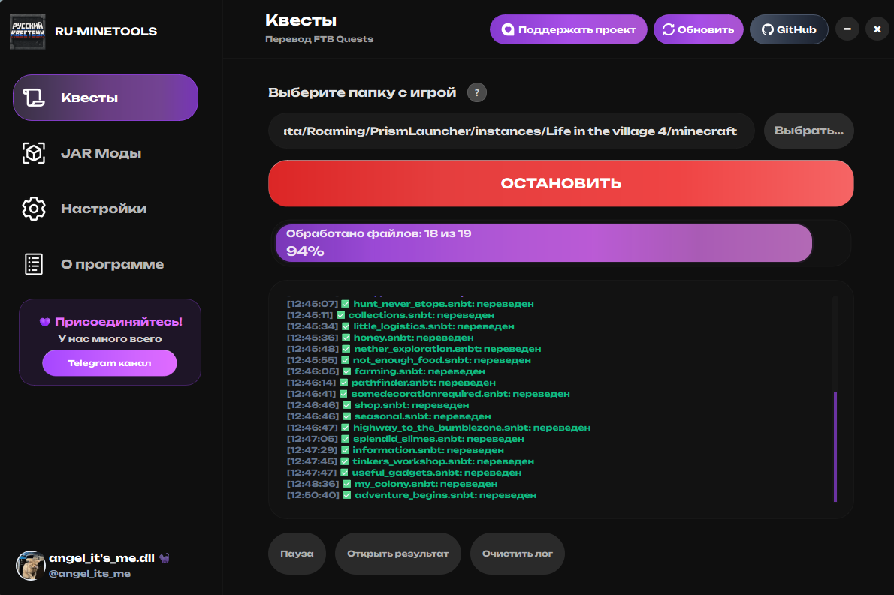
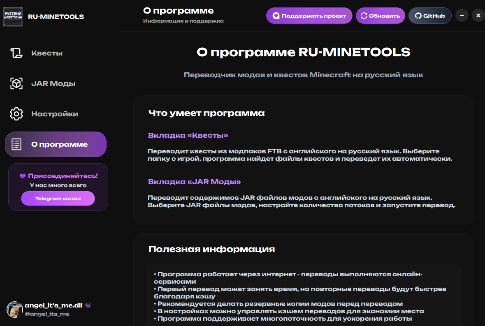

# RU-MINETOOLS - Перевод квестов и модов на русский язык!

**Программа для перевода модов и квестов Minecraft на русский язык**

*Переводите любые моды одним кликом. Работает с FTB квестами и JAR модами!*

### Основные возможности
- **Переводит FTB квесты** - Все задания и описания станут понятными
- **Переводит JAR моды** - Интерфейсы, предметы, блоки на русском
- **Быстро работает** - Многопоточная обработка файлов
- **Умный перевод** - Использует словарь игровых терминов
- **Помнит переводы** - Кэширует результаты для скорости
- **Сама обновляется** - Скачивает новые версии автоматически

## 📥 Скачать программу

📸 <strong>Скриншоты интерфейса</strong>

## ⚡ Что умеет программа

### 🎯 Все для комфортной игры на русском!

| Функция | Описание | Результат |
|---------|----------|-----------|
| **📜 FTB Квесты** | Переводит .snbt файлы квестов | **Все задания на русском языке** |
| **📦 JAR Моды** | Переводит языковые файлы в модах | **Интерфейсы и предметы на русском** |
| **⚡ Кэширование** | Запоминает переводы | **Повторный перевод за секунды** |
| **🔄 Обновления** | Автоматически обновляется | **Всегда свежая версия** |

## 💝 Поддержать проект

**Карта Сбербанка:** `2202 2067 3893 4277`

## 📝 История обновлений

| Версия | Дата | Что нового |
|--------|------|------------|
| **v1.0.0** | 25.12.2024 | 🎉 **ПЕРВЫЙ РЕЛИЗ!** Перевод FTB квестов и JAR модов, система авторизации через Telegram, автообновления, кэширование переводов, умная терминология |

## 🐛 Есть проблемы?

## 👨💻 Автор

**k1n1maro**

---

⭐ **Поставьте звезду, если программа понравилась!**

*Сделано с ❤ для русского Minecraft сообщества*

## 🏷️ Теги и ключевые слова

`minecraft` `моды` `перевод` `русский` `квесты` `ftb` `modpack` `локализация` `русификация` `майнкрафт` `mods` `translation` `russian` `quests` `forge` `fabric` `переводчик` `gaming` `игры` `tools` `утилиты` `бесплатно` `free` `opensource` `windows` `minecraft-mods` `minecraft-tools` `ru-mods` `russian-mods` `quest-translation` `mod-translation` `minecraft-russian` `майнкрафт-моды` `русские-моды` `ftb-quests` `jar-mods` `автоперевод` `локализатор` `русификатор` `minecraft-localization` `mod-localization` `quest-localization` `python` `pyqt6` `gui` `desktop-app` `telegram-bot` `auto-update` `caching` `multithreading` `minecraft-forge` `minecraft-fabric` `modded-minecraft` `minecraft-translation-tool`

