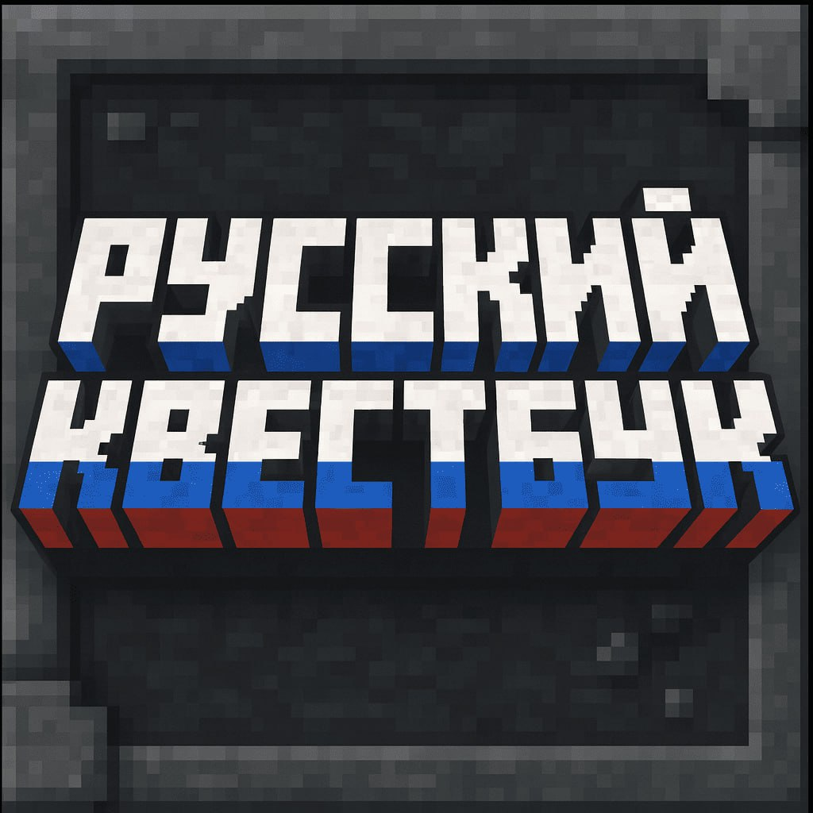

# 🎮 RU-MINETOOLS

**Простая программа для перевода модов и квестов Minecraft на русский язык**

**🎯 [СКАЧАТЬ RU-MINETOOLS](https://github.com/k1n1maro/ru-minetools/releases/latest) 🎯**

---

## 🤔 Зачем это нужно?

Играете в модпаки, но не все понимаете из-за английского языка? Эта программа поможет перевести:

- 📜 **Квесты** - все задания и описания станут на русском
- 📦 **Моды** - интерфейсы, предметы, блоки переведутся автоматически  
- 🎨 **Сохранит красоту** - все цвета и форматирование останется как было
- ⚡ **Быстро работает** - помнит уже переведенное для ускорения

## 📥 Как установить?

Просто скачайте готовую программу и запустите!

**Работает на Windows 10/11. Никаких дополнительных программ устанавливать не нужно.**

## 🚀 Как пользоваться?

### 🔐 Первый раз
1. Подпишитесь на наш [канал в Telegram](https://t.me/ruquestbook) 📢
2. Напишите [боту](https://t.me/ru_minetools_auth_bot) - он даст код 🤖
3. Введите код в программе ✅

### 📜 Переводим квесты
1. Найдите папку с квестами (обычно в `.minecraft/config/ftbquests`) 📁
2. Выберите её в программе 👆
3. Жмите "Перевести" и ждите ⏳

### 📦 Переводим моды
1. Найдите папку с модами (`.minecraft/mods`) 📁
2. Выберите её в программе 👆
3. Жмите "Перевести" 🔄
4. Переведенные моды появятся в новой папке 📂

## 🆘 Нужна помощь?

**Заходите в наш [Telegram канал](https://t.me/ruquestbook) - там всегда помогут!** 💬

Или создайте [вопрос на GitHub](https://github.com/k1n1maro/ru-minetools/issues) 🐛

**Частые проблемы:**
- 🚫 **Не запускается** → Попробуйте от имени администратора
- 🔐 **Не работает код** → Проверьте подписку на канал
- 🐌 **Медленно переводит** → Это нормально для больших модпаков

---

**💖 Сделано с душой для русского майнкрафт сообщества 💖**

*Если программа помогла - поставьте звездочку!* ⭐

**🎮 Играй на родном языке! 🎮**

